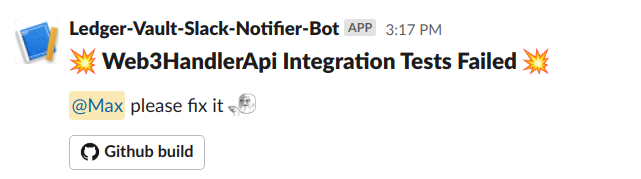

# slack-notification

Github action to send a Slack-notification to a specific channel.

**Perfect use case it to use it when merging/pushing on <ins>main</ins> with failing CI**



## Needed env variable

- `SLACK_WEBHOOK_URL` (required) is specific for each channel. Take care to select it for a channel dedicated for notifications.
- `SLACK_CUSTOM_PAYLOAD` (required) payload of the message that will be sent to slack channel. In order to ping someone, just add `<@SLACK_MEMBER_ID>` and this action will replace `SLACK_MEMBER_ID` with the UID. Example below.
- `SLACK_API_TOKEN` (not required). If given, it will take the github name of the last commit author and turn it to a ledger email address `surname.name@ledger.fr` to be able to find the slack id related.
- `SLACK_MEMBER_ID` (not required). Slack member ID of someone. Can be used instead of `SLACK_API_TOKEN` if you want to ping a specific person.

> [!CAUTION]
> Go easy !! <ins> Abusive notifications (especially with ping) can be annoying. </ins>

## Action usage

```yaml
- uses: LedgerHQ/actions/slack-notification@main
  env:
    # Token used to send a message on a specific channel
    SLACK_WEBHOOK_URL: ${{ secrets.SLACK_WEBHOOK_URL }}
    # Token used to get the list of Slack user (currently only those that are in #vault-pi-x--xxx
    SLACK_API_TOKEN: ${{ secrets.SLACK_API_TOKEN }}
    # Message to send
    SLACK_CUSTOM_PAYLOAD: |-
            {
              "blocks": [
                {
                  "type": "header",
                  "text": {
                    "type": "plain_text",
                    "text": ":boom: Web3HandlerApi Integration Tests Failed :boom:",
                    "emoji": true
                  }
                },
                {
                  "type": "section",
                  "text": {
                    "type": "mrkdwn",
                    "text": "<@SLACK_MEMBER_ID> please fix it :iamwatchingyou:"
                  }
                },
                {
                  "type": "actions",
                  "elements": [
                    {
                      "type": "button",
                      "text": {
                        "type": "plain_text",
                        "text": ":github: Github build",
                        "emoji": true
                      },
                      "url": "https://github.com/${{ github.repository }}/actions/runs/${{ github.run_id }}"
                    }
                  ]
                },
                {
                  "type": "divider"
                }
              ]
            }
```

## Contribute

Open a PR to contribute, the CI and reviewer will take care of the rest.
